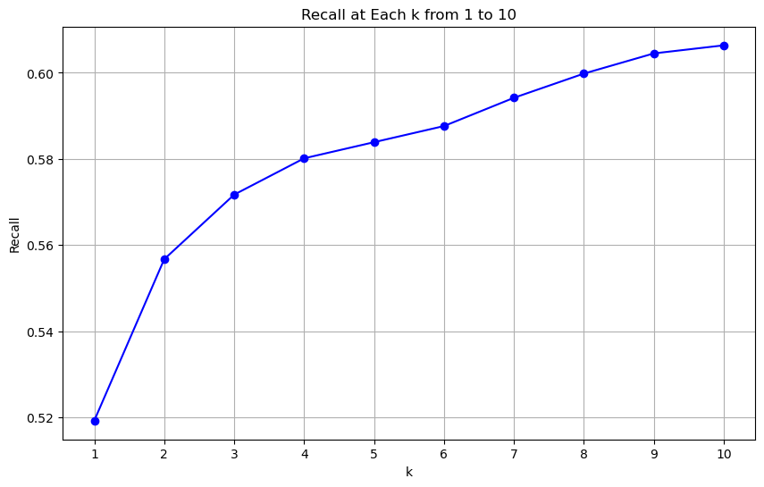
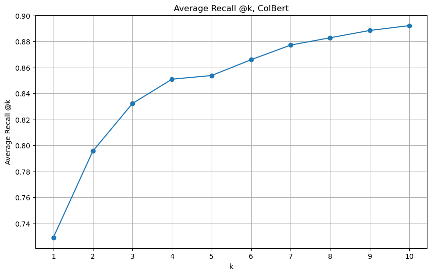
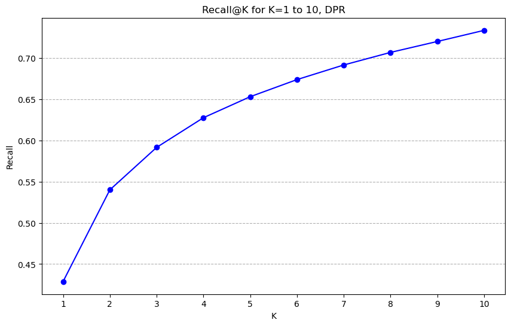
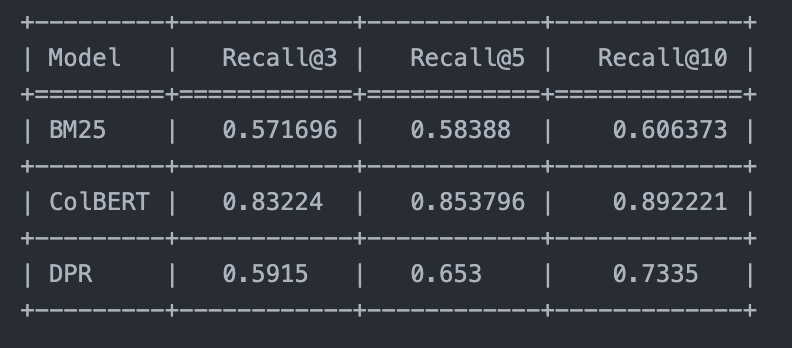

# Exploring Retrieval models

Baseline models are evaluated on the BookSum dataset 6B as well as the 175B dataset, we evaluate the performance of each model at both the depth 3 and depth 2 summary levels. (Although only the results for depth 2 are shown for our purposes)

The model retrieves the top k most relevant chunks from a single book, based on the query (which in this case is either the depth-2 or depth-3 summary of a chunk of the book). 

See [notebook](results.ipynb) which consolidates all models and also present the results.

1. BM25

2. ColBert

3. DPR

Overall results

Attributions: 

https://openaipublic.blob.core.windows.net/recursive-book-summ/website/index.html?data_id=6b%2F5&dataset=booksum#/booksum